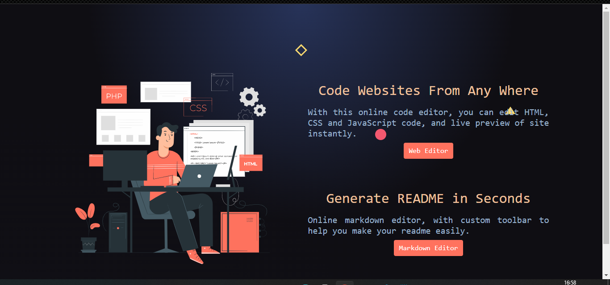
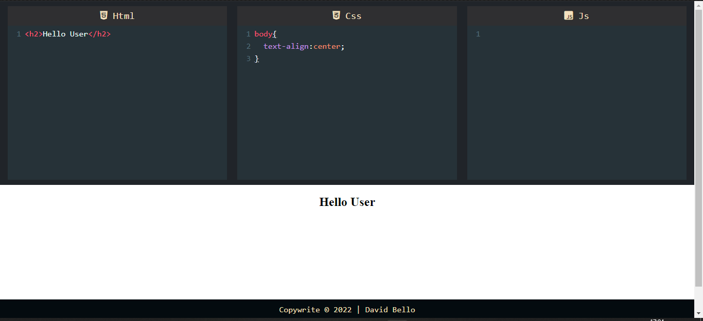
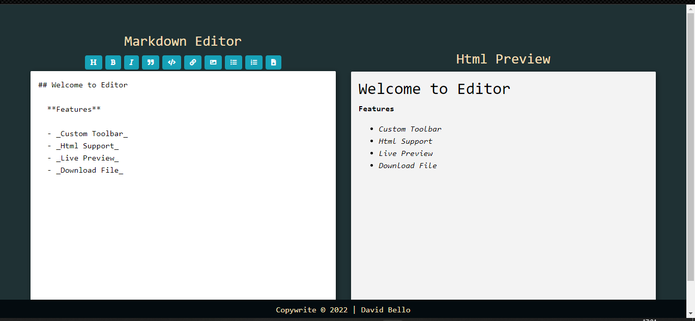

# Editor.io
## https://codetrix.netlify.app/

## Online code editor for HTML, CSS and Javascript to discover frontend code

  

  

### Features:

- No installation, work online and build web pages.
- Auto Save of all your work
- Supports JQuery
- Autoclose of tags and brackets
- Live Preview

## Online Markdown editor for generating Readme Files

  

## Features

- GFM
- Supports Html Tags
- Custom toolbar to make editing easier
- Live Preview
- Auto save of work
- Download the file Readme.md file

### Show your support

Give a ⭐ if you like this website!
